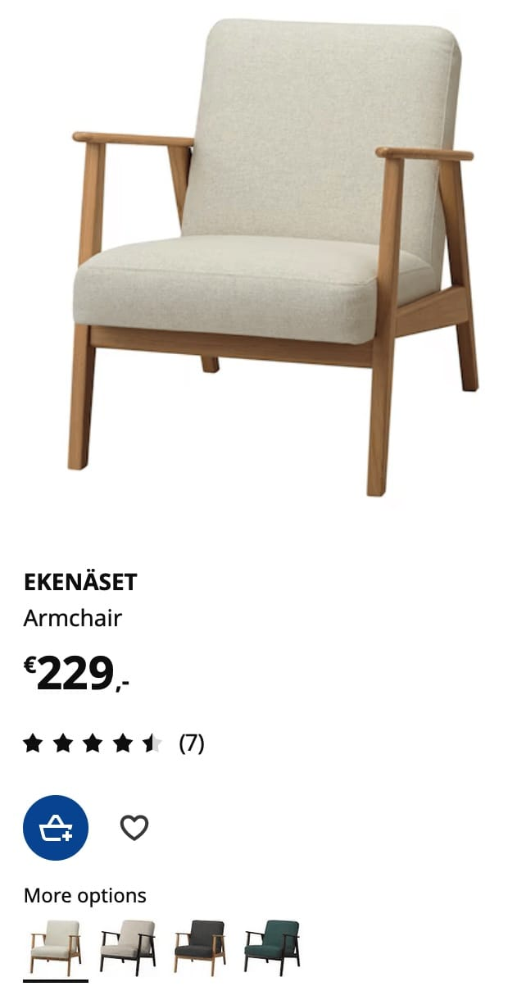

[Zurück zur Session-Übersicht](../readme.md)

**Session 01 - Übung A**

# Components für ein UI-Element definieren

Betrachte den folgenden Screenshot von der [IKEA](https://ikea.com)-Website. Dieses UI-Element zeigt ein Produkt, das Nutzer im Online-Shop kaufen können.

## Aufgabe: Components identifizieren

Überlege dir die einzelnen UI-Components, aus denen alles besteht, was auf dem Screenshot zu sehen ist.

Finde einen Namen für jede einzelne UI-Component und schreibe sie in **CamelCase** auf.

Verwende ein Tool wie [Excalidraw](https://excalidraw.com/), um Rechtecke auf dem Screenshot zu zeichnen und die einzelnen UI-Components zu markieren.
